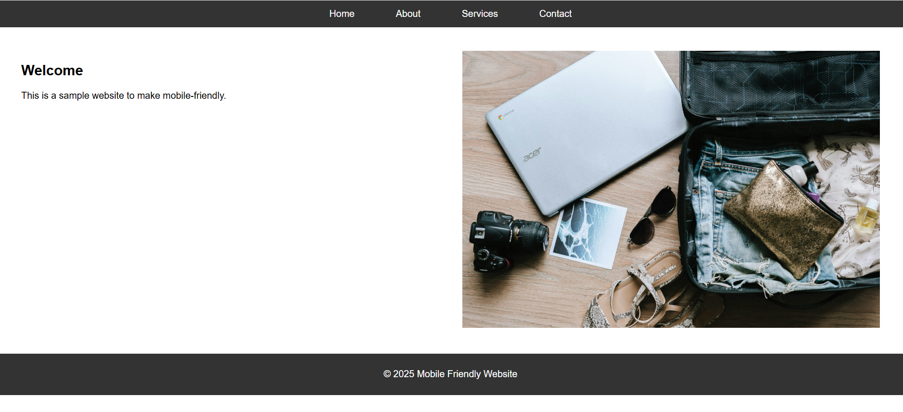

# Task 4 - Make a Website Mobile-Friendly Using CSS Media Queries

## 📌 Objective
Convert an existing desktop-only webpage into a **mobile-friendly** layout using **CSS media queries**.

---

## 🛠 Tools & Technologies Used
- **HTML5**
- **CSS3 (Media Queries)**
- **VS Code**
- **Brave Browser DevTools** (for mobile testing)

---

## 📂 Project Structure
```
Task4-Mobile-Friendly/
│── index.html
│── style.css
│── images/
│ ├── hero.jpeg # Website hero section image
│ └── mobile-friendly-T4preview.png # Screenshot of final result
└── README.md
```

---

## 🚀 Features Implemented
- Added **responsive design** using CSS media queries.
- Layout adapts for:
  - **iPhone SE** (320px width)
  - **iPhone 14 Pro Max** (430px width)
  - **iPad Air** (820px width)
  - **Desktop** (1024px+ width)
- Navigation menu stacks vertically on small screens.
- Images scale within their containers to prevent overflow.
- Fixed horizontal scroll and overflow issues.

---

## 📸 Screenshot


---

## 🌐 Live Demo
[](https://aarjav-jain151.github.io/mobile-friendly-T4/)


---

## 📱 Testing
Tested using **Brave Browser DevTools**:
1. Right-click → **Inspect** → Toggle Device Toolbar 📱.
2. Checked responsiveness for:
   - iPhone SE
   - iPhone 14 Pro Max
   - iPad Air
   - Desktop
3. Confirmed images and layout adjust correctly.

---

## ⚡ How to Run Locally
1. Clone this repository:
   ```bash
   git clone https://github.com/aarjav-jain151/task4-mobile-friendly.git

